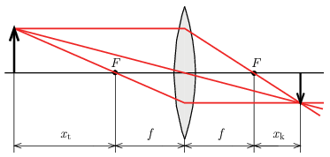

G. 855. Newton nem a szokásos alakjában $\left(\tfrac{1}{t}+\tfrac{1}{k}=\tfrac{1}{f}\right)$ írta fel a leképezési törvényt. Ő a tárgyoldali fókuszponttól mérte az $x_\mathrm{t}$ fókuszontúli tárgytávolságot, illetve a képoldali fókuszponttól mérte az $x_\mathrm{k}$ fókuszontúli képtávolságot, ahogy ez az ábrán látható.

 $a)$ Adjuk meg a legegyszerűbb alakban a leképezési törvényt ezekkel a paraméterekkel!
 $b)$ Hogyan alkalmazható ez a képlet szórólencsékre?

