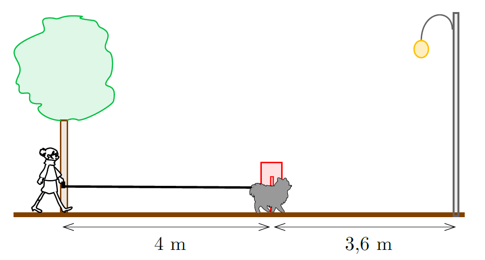

G. 861. Panni sétálni vitte Fickó nevű kutyáját. A sugárúton Panni $0{,}8~\mathrm{m}/\mathrm{s}$ sebességgel haladt, amikor egy hársfa mellett elejtette a lakáskulcsát. Fickó ekkor a hársfától 4 méterre lévő szemeteskukánál járt. Fickó sebessége $1{,}2~\mathrm{m}/\mathrm{s}$ volt. Amikor Fickó a kukától $3{,}6$ méterre lévő lámpaoszlophoz ért, visszafordult, és a kuka és a lámpaoszlop között ide-oda szaladt $1{,}2~\mathrm{m}/\mathrm{s}$ sebességgel. Amikor Panni a kukához ért, észrevette, hogy elejtette a kulcsot, ezért visszafordult érte. Ő végig $0{,}8~\mathrm{m}/\mathrm{s}$ sebességgel mozgott.

 Hogyan változott a végig feszes póráz hossza a kulcs elejtésétől annak kézhez vételéig? Készítsünk grafikont!

