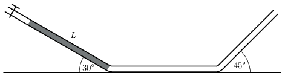

G. 866. Egy kétszeresen meghajlított vékony cső három, elegendően hosszú részből áll. A középső rész vízszintes, az első rész $30^\circ$-os szöget, a harmadik rész pedig $45^\circ$-os szöget zár be a vízszintessel. A szakaszok ugyanabban a függőleges síkban fekszenek, az egyes szakaszokat rövid, törésmentes hajlatok kötik össze. A cső bal oldali végén egy csap annyi levegőt zár el a külvilágtól, hogy a bal oldali csőszakasz alján $L$ hosszúságú higanyszál legyen nyugalmi állapotban. A csapot hirtelen kinyitjuk, emiatt a higanyszál súrlódásmentesnek tekinthető mozgásba kezd. Induláskor a higanyszál eleje a cső első és második szakaszának találkozásánál van.
 A higanyszálnak maximálisan mekkora része kerül be a cső harmadik szakaszába?

