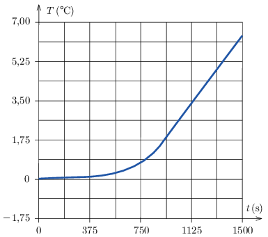

G. 867. Egy kaloriméterben jég és víz keveréke van. A kalorimétert állandó fűtőteljesítménnyel melegítjük, és mérjük a tartalmának hőmérsékletét, amelyet az idő függvényében ábrázoltunk.

 A mérés végén $850~\mathrm{ml}$ víz volt a kaloriméterben. Állapítsuk meg, hogy mekkora a fűtőteljesítmény, valamint azt, hogy mennyi jég volt kezdetben a kaloriméterben!

