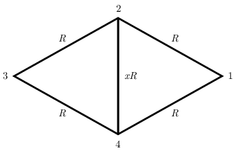

G. 868. Az ábrán látható rombusz oldalélei $R$ ellenállásúak, az egyik átlós élének ellenállása pedig $xR$, ahol $x\ge 0$ egy változtatható paraméter. Két tetszőleges csúcspontra $U$ feszültséget kapcsolunk. Számítsuk ki minden lehetséges esetben az öt ellenálláson fejlődő teljes hőteljesítményt az $x$ paraméter függvényében!

