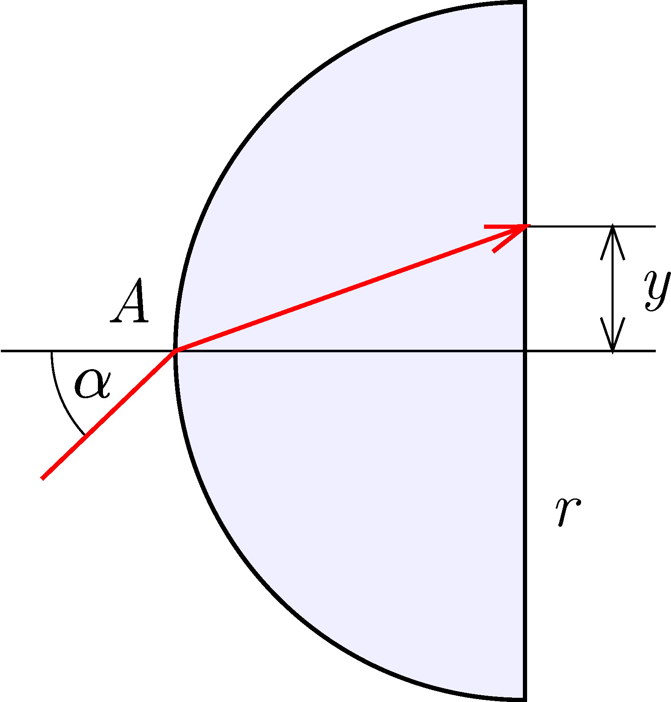

G. 884. Egy $r$ sugarú, $1{,}5$ törésmutatójú üvegből készült félgömbre az ábra szerinti $A$ pontban fénysugarat ejtünk. A megtört fénysugár a félgömb síklapját a középponttól $y$ távolságban éri el.

 a) Mekkora beesési szög esetén lesz $y$ a sugár felével egyenlő?
 b) Milyen színű a fénysugár, ha a fény hullámhossza az üvegben $400\,\mathrm{nm}$?

