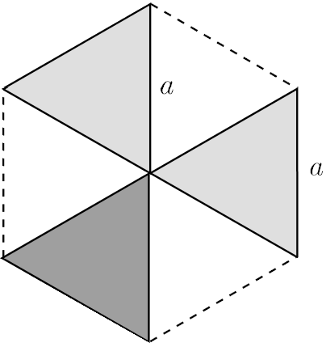

G. 894. Egy $a$ oldalú, homogén tömegeloszlású, szabályos hatszög alakú lemezből az ábra szerint kivágunk három darab, $a$ oldalú, szabályos háromszög alakú részt, majd a kivágott három darabot az egyik maradék háromszögre tesszük. Hol van az így kapott idom tömegközéppontja?

