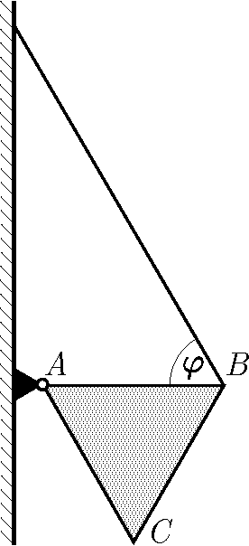

G. 907. Az egyenletes tömegeloszlású, $m=0{,}7~\mathrm{kg}$ tömegű, $ABC$ szabályos háromszög alakú lemez $A$ csúcsa az ábra szerint csuklóval csatlakozik a függőleges falhoz. A háromszög vízszintes $AB$ oldalának $B$ végpontját egy fonál köti össze a fallal. A fonál a vízszintessel $\varphi=60^\circ$-os szöget zár be.

 a) Mekkora erő ébred a fonálban?

 b) Mekkora nagyságú, és milyen irányú erővel terheli a háromszöglemez a csuklót?

