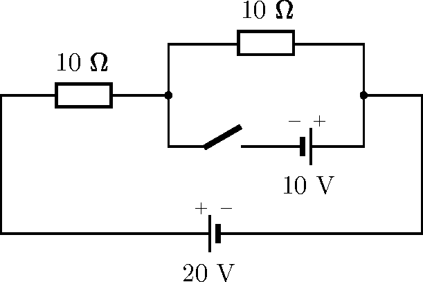

G. 912. Az ábrán látható áramkörben kezdetben a kapcsoló nyitva van.

 a) Mekkora áramok folynak az áramkör ellenállásain és a telepeken a kapcsoló zárása előtt és után?

 b) Mekkora áramok folynak, ha a kapcsoló melletti feszültségforrás polaritását megfordítjuk?

