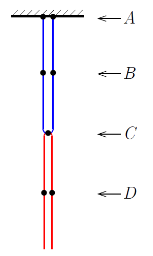

G. 918. Egy $2~\mathrm{kg}$ tömegű és $2~\mathrm{m}$ hosszú kötél mindkét végét (egymáshoz közel) a mennyezethez rögzítjük, majd a hurok alsó pontján átvetünk egy másik ugyanolyan kötelet. Mekkora az egyes kötelekben ébredő feszítőerő az ábrán látható hét pontban?

