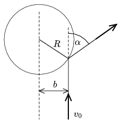

M. 285. Nagy tömegű fazék vagy lábos felé gurítsunk egy golyót v $_{0}$ sebességgel! Végezzünk méréseket, s ezek alapján határozzuk meg, hogyan függ az ábrán látható szög a b távolságtól (az ún. ütközési paramétertől), valamint a v $_{0}$ sebességtől!
 Varga István feladata

