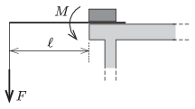

M. 347. Rögzítsünk hurkapálcát egy asztal szélére! Terheljük fokozatosan a szabad végét, vagy akasszunk rá erőmérőt! Mérjük meg a pálca eltöréséhez szükséges $M$  forgatónyomatékot, illetve a terhelő erő $W$  munkáját! Változnak-e a mérési eredmények, ha a hurkapálca asztalon túl kinyúló részének $\ell$ hosszát a felére csökkentjük?

 Varga István (1952-2007) feladata

