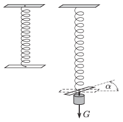

M. 348. Egy megterhelt csavarrugónak nemcsak a hossza változik meg, hanem a rugó - ha az egyik vége szabadon elfordulhat - bizonyos mértékig ,,kicsavarodik''. Mérjük meg, hogyan függ a rugó végének szögelfordulása a terhelő erőtől! Végezzünk méréseket különböző menetszámú és különböző erősségű rugókkal!

