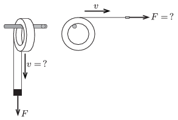

M. 349. Vízszintes, rögzített tengelyre helyezzünk egy tekercs átlátszó (cellux- vagy csomagzáró) ragasztószalagot! A szalag végét bizonyos nagyságú erővel húzzuk függőlegesen lefelé. Vizsgáljuk meg, miként tekeredik (tépődik) le a szalag különböző nagyságú húzóerőknél! Keressünk kapcsolatot az  átlagos letekeredési sebesség és a húzóerő között!

 Választható a mérés egy másik változata: adott sebességgel tépjük le a szalagot, és vizsgáljuk az ehhez szükséges erő átlagos értékét! (A két mérési lehetőség közül csak az egyiket kell elvégezni!)

