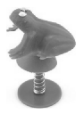

M. 352. Mérjük meg egy rugós ,,ugráló béka'' rugóállandóját! A béka úgy hozható mozgásba, hogy a tapadógumit a rugó tengelyének irányában rányomjuk a korongra. (Aki nem tud ugráló békát beszerezni, egy rugós golyóstollal is elvégezheti a mérést.)

 Becslési verseny, Sárospatak

