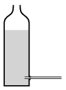

M. 364. Egy hengeres műanyagflakon oldalán, az aljától néhány cm-re fúrjunk egy lyukat, és ragasszunk bele egy vízszintesen benyúló szívószálat. Mérjük meg a kifolyó víz sebességét a vízmagasság függvényében!

