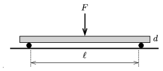

M. 367. Készítsünk hengeres jégpálcákat (pl. mélyhűtőben fagyasztott vízből, lezárt végű műanyagcső segítségével)! A két végén alátámasztott pálcát a közepénél fokozatosan terheljük meg annyira, hogy eltörjön. Adjuk meg a töréshez szükséges erőt több, különböző hosszúságú és átmérőjű jégpálcára!

