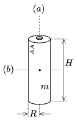

M. 369. Mérjük meg egy (AA jelzésű) ceruzaelem tehetetlenségi nyomatékát a hossztengelyére ($a$), valamint az erre merőleges, a tömegközéppontján átmenő tengelyre ($b$) vonatkozóan!

 Adjuk meg az eredményt $mR^2$, illetve $mH^2$ egységekben is ($R$ a ceruzaelem sugara, $H$ a magassága, $m$ a tömege).

