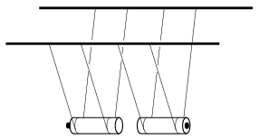

M. 371. Ütköztessünk egymással két – bifilárisan felfüggesztett – (azonos fajtájú, AA-típusú) ceruzaelemet úgy, hogy az elemek a hossztengelyük mentén mozogjanak, és a negatív (laposabb) részük csapódjon össze. Határozzuk meg az  ütközési számot (vagyis azt, hogy mekkora az ütközés utáni és az ütközés előtti relatív sebességek aránya). Végezzük el a mérést két új elemmel, egy új és egy lemerült elemmel, illetve két lemerült elemmel is!

