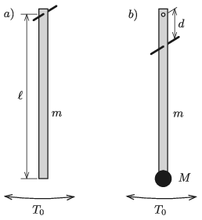

M. 401. Készítsünk egy $m$ tömegű, $\ell$ hosszúságú, homogén tömegeloszlású, az egyik végén tengelyezett, vékony lécből fizikai ingát. ($m$ és $\ell$ szabadon választható értékek, amelyeket a mérés során nem változtatunk.)

 $a)$ Mérjük meg a kissé kitérített inga $T_0$ lengésidejét!
 Ezután helyezzük át a forgástengelyt a léc egyik végétől $d$ távolságra, és rögzítsünk a léc másik végére egy pontszerűnek tekinthető, $M$ tömegű testet (például egy darab gyurmát). Ha megfelelően választjuk meg $M$ nagyságát, akkor az így kapott fizikai inga lengésideje az eredeti $T_0$-lal egyezik meg.
 $b)$ Mérjük meg, hogyan függ a $M/m$ tömegarány a $d/\ell$ távolságaránytól!

