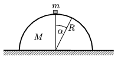

P. 3860. Vízszintes asztalon nyugszik egy R sugarú, M tömegű félhenger. A tetején áll egy m = M /2 tömegű kicsiny kocka. Mekkora erővel nyomja a lecsúszó kocka a félhengert =30$^\circ$-os helyzetben, ha

 a ) a félhenger rögzített;
 b ) a félhenger súrlódás nélkül csúszhat az asztalon?

