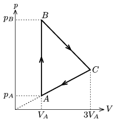

P. 3869. Bizonyos mennyiségű ideális gáz az ábrán látható körfolyamatot végzi. A gáz hőmérséklete az A állapotban T $_{ A }$=200 K. A B és C állapotokban a hőmérséklet egyenlő.

 a ) Mekkora a legmagasabb hőmérséklet a körfolyamat során?
 b ) Ábrázoljuk a körfolyamatot a T - V diagramon!

