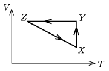

P. 3899. Ideális gáz az ábrán látható körfolyamatot végzi. Az X állapotban T $_{ X }$=373 K, V $_{ X }$=5 dm$^{3}$. A  Z állapotban V $_{ Z }$=12 dm$^{3}$, T $_{ Z }$=273 K. A  Z X folyamat melyik állapotában lesz a gáz nyomása éppen akkora, mint az Y állapotban?

