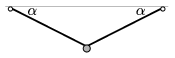

P. 3926. Egy elhanyagolható tömegű gumiszál végeit azonos magasságban rögzítjük, ekkor a szál egyenes és nyújtatlan. A közepére egy kis testet erősítünk, a gumiszál lehajlása ekkor =30$^\circ$. Ezután elektromos töltést adunk a kis testnek, és függőleges irányú, kétféle elektromos teret alkalmazunk. Először $_{1}$=45$^\circ$, másodszor $_{2}$=60$^\circ$ lesz a szálak lehajlása az új egyensúlyi helyzetben.

 Hányszorosa a térerősség a második esetben az első esetbeli térerősségnek?

