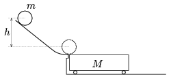

P. 3929. Teljesen sima, vízszintes síkban törésmentesen folytatódó súrlódásmentes lejtőről forgásmentesen és kezdősebesség nélkül induló m =12 kg tömegű, R =0,1 m sugarú korong h =1,25 m magasból lecsúszva egy M =6 kg tömegű, könnyen gördülő kiskocsi tetejére érkezik. A korong és a kocsi között a csúszási súrlódás együtthatója =0,4. A korong a kocsi közepén kezd el csúszásmentesen gördülni.

 a ) Milyen hosszú a kocsi?
 b ) Mekkora a kocsi legnagyobb sebessége?
 c ) Mennyi idő alatt fut át a kocsin a korong?

