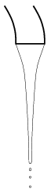

P. 3968. Este nyolckor zártuk el a kerti vízcsapot, de sajnos rosszul. Lefelé vékonyodó sugárban folyik belőle a víz, az ábrán látható módon. A vízsugár kör keresztmetszetű, átmérője az egyik helyen 6 mm, ennél 4 cm-rel lejjebb már csak 3,4 mm. Mennyi vizet pazarolunk el, ha csak másnap reggel nyolckor zárjuk el rendesen a csapot? (Az áramló víz belső súrlódását elhanyagolhatjuk.)

