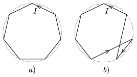

P. 3969. Szigetelő huzalból készült két hurok mindegyikében azonos I erősségű áram folyik az ábrán jelölt irányban. A hurkok csúcspontjai egy szabályos n -szöget alkotnak. Melyik esetben lesz nagyobb a mágneses tér a hurkok köré írt kör középpontjában?

