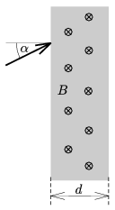

P. 3970. A B =10$^{-3}$ T mágneses indukciójú, d =2 cm szélességű homogén mágneses mezőbe egy elektront lövünk be a mágneses erővonalakra merőlegesen, a határfelületre merőleges egyenessel =30$^\circ$-os szöget bezáróan.
 a ) Legalább mekkora sebességgel kell belőni az elektront ahhoz, hogy áthaladjon a d szélességű homogén mágneses mezőn?
 b ) Mekkora az a sebesség, amelynél kisebb belövési sebességek esetén semmiképpen nem tudjuk átjuttatni az elektront a d szélességű homogén mágneses mezőn?

