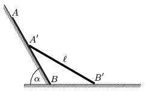

P. 3978. Egy m tömegű és =1 m hosszúságú rúd egyik végével az =60$^\circ$-os lejtőn, másik végével pedig a vízszintes talajon súrlódásmentesen mozogva lecsúszik. Kezdetben a rúd a lejtőhöz simulva áll, mozgásának egy közbülső helyzetét látjuk az ábrán.

 a ) Mekkora a rúd A , illetve B végpontjának sebessége, amikor a rúd eléri a vízszintes helyzetet?
 b ) Mekkorák ezek a sebességek, amikor a rúd 30$^\circ$-os szöget zár be a vízszintessel?

