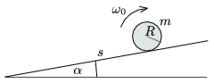

P. 3991. Elég hosszú, hajlásszögű lejtő aljától s távolságra egy R sugarú, m tömegű tömör hengert az ábrán látható irányban $_{0}$ szögsebességgel megforgatva óvatosan a lejtőre helyezünk és kezdősebesség nélkül elengedünk. Milyen távolra jut el a henger a lejtő aljától, és mekkora sebességgel érkezik a lejtő aljára, ha
 a ) =30$^\circ$ és =0,2;
 b ) =20$^\circ$ és =0,4?

 Adatok: s =2 m, R =0,2 m, $_{0}$=100 s$^{-1}$.

