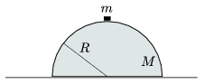

P. 3992. R sugarú, M tömegű félgömb alakú homogén test súrlódás nélkül csúszhat a vízszintes asztalon. Tetejéről zérus kezdősebességgel indul egy m tömegű kis test, amely súrlódás nélkül lecsúszik róla.

 a ) Mekkora sebességre gyorsul fel a félgömb?
 b ) Mekkora sebességgel és hol érkezik az asztalra a kis test?

