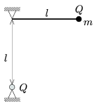

P. 4011. Az ábra szerinti elrendezésben a vízszintes helyzetű szigetelő fonál rögzített vége alatt, a fonál hosszával megegyező mélységben levő rögzített töltés ugyanakkora, mint a fonál szabad végén levő kicsiny test töltése. A testet elengedve legmélyebb helyzetében a fonál a vízszintessel 30$^\circ$-os szöget zár be.

 a ) Mekkora a mozgó test tömege?
 b ) Mekkora a fonálerő az alsó helyzetben?
 c ) Hányszorosa az alsó helyzetben a test gyorsulása a kezdeti gyorsulásnak?

