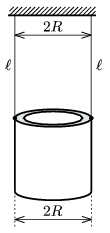

P. 4017. 2 R külső átmérőjű, ismeretlen falvastagságú csövet függesztettünk fel két hosszúságú fonállal az ábra szerint. Ha a csövet kis kitérésű torziós lengésbe hozzuk, T lengésidőt mérhetünk. Mennyi a cső falának vastagsága?

