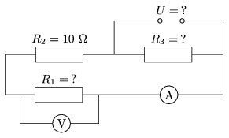

P. 4024. Az ábrán látható kapcsolásban az R $_{3}$ ellenállásra jutó teljesítmény 15 W. Az árammérő 500 mA-t, a feszültségmérő 10 V-ot jelez. Mekkora az R $_{1}$ és R $_{3}$ ellenállások értéke? Mekkora az áramforrás feszültsége?

