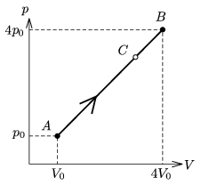

P. 4049. Bizonyos mennyiségű, kétatomos molekulákból álló gáz az ábrán látható folyamattal megy át az A állapotból a B állapotba; p $_{0}$=10$^{5}$ Pa, V $_{0}$=2 dm$^{3}$.

 a ) Határozzuk meg a gáz nyomását és térfogatát abban a közbülső C állapotban, ameddig csupán Q $_{ AC }$=3150 J hőt közöltünk a gázzal!
 b ) Hányszorosára nőtt az A C folyamatban a gáz belső energiája?
 c ) Mennyi munkát végzett a táguló gáz az A C folyamatban?

