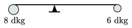

P. 4077. Egy 8 dkg és egy 6 dkg tömegű golyó egy 28 cm hosszú, elhanyagolható tömegű pálca végeihez van rögzítve. A pálca úgy van alátámasztva egy ékkel, hogy vízszintes helyzetben egyensúlyban maradjon. Mekkora szöggyorsulással indul el vízszintes helyzetéből a pálca, ha az éket a nagyobb tömegű golyóhoz 2 cm-rel közelebb helyezzük el?

