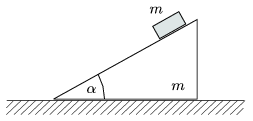

P. 4097. Az ábra szerinti hajlásszögű, m tömegű ék súrlódásmentesen csúszhat a vízszintes asztalon. Az ékre egy m tömegű téglatestet teszünk, mely súrlódásmentesen lecsúszik. Mekkora  szög esetén lesz az ék gyorsulásának nagysága a nehézségi gyorsulásnak legalább harmad része?

