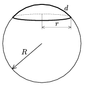

P. 4113. Van de Graaff-generátor R sugarú gömbjének tetejére d vastagságú,  sűrűségű, r  alapsugarú, alufóliából készült gömbsüveget helyezünk. Mekkora feszültségnél emelkedik fel a süveg a gömbről?

 Varga István

