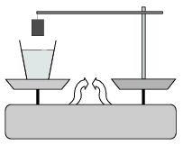

P. 4117. Egy mérleg egyik serpenyőjén vizet tartalmazó edény, a másikon pedig egy állvány van, amelyre 108 g tömegű alumínium hengert akasztottunk. A mérleg egyensúlyban van. Ha a fonalat meghosszabbítva a hengert teljesen a vízbe lógatjuk, az egyensúly megbomlik. Mekkora tömegű testet kell ekkor a jobb oldali serpenyőbe tennünk, hogy visszaállítsuk az egyensúlyt?
 Jedlik Ányos fizikaverseny, Nyíregyháza

