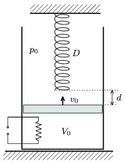

P. 4121. Függőleges, hőszigetelt, alul zárt, A =2 dm$^{2}$ keresztmetszetű hengerben lévő, súrlódásmentesen mozgó, m =20 g tömegű dugattyú héliumgázt zár el. A dugattyú felett lévő, rögzített tartóhoz egy nyújtatlan, D =2000 N/m direkciós erejű nyomórugót rögzítettünk, melynek alsó vége V $_{0}$=8 dm$^{3}$ gáztérfogat esetén d =2 dm távolságra van a dugattyútól. A külső légnyomás p $_{0}$=10$^{5}$ Pa, g =10 m/s$^{2}$. A bezárt gázt egy olyan, automatikusan vezérelt elektromos fűtőszál melegíti, amely folyamatosan biztosítja azt, hogy a dugattyú állandó, v $_{0}$=5 cm/s sebességgel mozog a hengerben.

 a ) Adjuk meg és ábrázoljuk a fűtőszál pillanatnyi teljesítményét az idő függvényében abban az intervallumban, míg a gáz térfogata V $_{0}$-ról V $_{1}$=18 dm$^{3}$-re növekszik!
 b ) Mennyi hőt közölt a fűtőszál a táguló gázzal a folyamat során?

