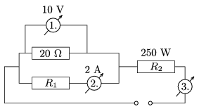

P. 4136. Az ábrán látható kapcsolásban az R $_{2}$ ellenállású fogyasztó teljesítménye 250 W. Mekkora az R $_{1}$ és R $_{2}$ ellenállás? Mennyit mutat a 3. műszer? Mekkora az áramforrás feszültsége?

