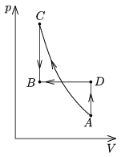

P. 4148. Bizonyos mennyiségű ideális gázt kétféleképpen viszünk át az A állapotból a kezdetivel azonos hőmérsékletű B állapotba:

 a ) Először adiabatikusan összenyomjuk ( AC ), majd állandó térfogaton lehűtjük ( CB );
 b ) Először állandó térfogaton felmelegítjük ( AD ), majd izobár módon összenyomjuk ( DB ).
 Melyik esetben végzünk kevesebb munkát? A C vagy a D állapotban nagyobb a gáz hőmérséklete?
 Varga István (1952-2007) feladata

