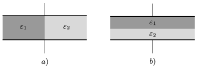

P. 4150. Síkkondenzátor egyik felét $_{1}$, másik felét $_{2}$ permittivitású szigetelővel töltjük ki, egyszer az  a ), másszor a b ) ábra szerint. Melyik esetben lesz nagyobb a kondenzátor kapacitása?

