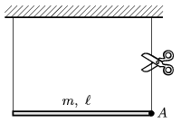

P. 4177. Az $m=0{,}5$ kg tömegű, $\ell=80$ cm hosszúságú homogén rudat két fonállal függesztjük fel. Mekkora lesz a rúd $A$  pontjának gyorsulása, valamint a bal oldali fonalat feszítő erő közvetlenül a jobb oldali fonál elvágása után?

 Cornides István verseny, Révkomárom (Szlovákia)

