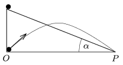

P. 4225. Egyszerre indul el egy golyó az $\alpha$ hajlásszögű lejtő tetejéről nyugalomból, és egy másik golyó az $O$ pontból, ferdén elhajítva. A $P$  pontba egyszerre érkeznek. Mekkora szögben kellett elhajítani a másik golyót?

 Vermes Miklós fizikaverseny, Sopron

