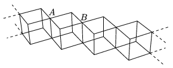

P. 4231. $R$ ellenállású fémhuzaldarabokból kockahálózatot készítünk az ábrán látható módon. A kockák igen hosszú, végtelennek tekinthető láncot alkotnak. Mekkora az $A$ és $B$ pont közötti eredő ellenállás?

