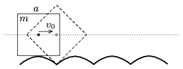

P. 4237. Egy $m$ tömegű, homogén tömegeloszlású, $a$  oldalélű kockának olyan pályát készítünk, amelyen csúszásmentesen végiggördülve a kocka középpontja egy vízszintes egyenes mentén mozog (,,négyszögletes kerék''). A pálya ,,tetőpontján'' a kocka középpontjának vízszintes irányú $v_{0}$ kezdősebességet adunk. A tapadási súrlódás elegendően nagy, így mozgása során a kocka sehol nem csúszik meg.

 Mekkora lesz a tömegközéppont sebessége, amikor a kocka a pálya legalsó pontját érinti? (A kocka tehetetlenségi nyomatéka a középpontjára vonatkoztatva $\frac{1}{6}\, ma^2$.)

