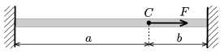

P. 4256. Két fal között egy gumiszálat feszítünk ki. A szál $C$ pontjában $F$ nagyságú, szálirányú erőt fejtünk még ki.

 $a)$ Mekkora a $C$ pont elmozdulása, ha a szál $D$ rugóállandóval jellemezhető?
 $b)$ A szál melyik pontjában hasson az $F$ erő, hogy e pont elmozdulása a lehető legnagyobb legyen?
 Adatok: $F=5$ N, $a=40$ cm, $b=10$ cm, $D=1~\frac{\rm N}{\rm cm}$.

