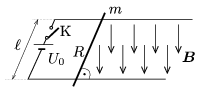

P. 4271. Homogén, függőlegesen lefelé mutató, $B=0{,}5~$T indukciójú mágneses erőtérben két párhuzamos, vízszintes síkú, egymástól $\ell=10$ cm-re lévő vezető sínt $U_{0}=12~$V feszültségű akkumulátorral kötünk össze. A sínekre, rájuk merőlegesen, $m=50~$g tömegű, $R=2~\Omega$ ellenállású fémrudat fektetünk. A fémrúd és a sín között $\mu=0{,}3$ a súrlódási együttható.

 $a)$ Mekkora gyorsulással indul el a fémrúd a K kapcsoló zárása után?
 $b)$ Mekkora sebességre gyorsulhatna fel a rúd, ha a sín igen hosszú lenne?
 $c)$ Becsüljük meg minél pontosabban, hogy mennyi idő alatt és mekkora úton nő a rúd sebessége 4,0 $\frac{\rm m}{\rm s}$-ról 4,1 $\frac{\rm m}{\rm s}$-ra!
 Wigner Jenő verseny, Békéscsaba

