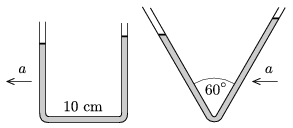

P. 4278. Üvegcsőből hajlított, U alakú közlekedőedényben 30 cm hosszú csőrészt tölt ki a víz. Az egyenletesen gyorsuló járműben a közlekedőedény száraiban a vízszintek különbsége 1 cm. Mekkora a jármű gyorsulása, ha a vízszintes csőrész hossza 10 cm?

 Mekkora lett volna a vízoszlopok hosszának különbsége, ha a 60$^\circ$-os szögben V alakúra hajlított (függőleges szimmetriatengelyű) közlekedőedényt használtuk volna, amelyben szintén 30 cm hosszú csőrészt tölt ki a víz?

